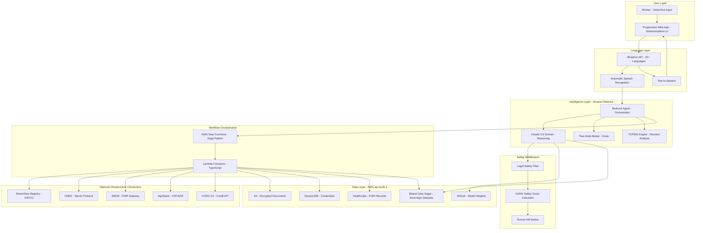
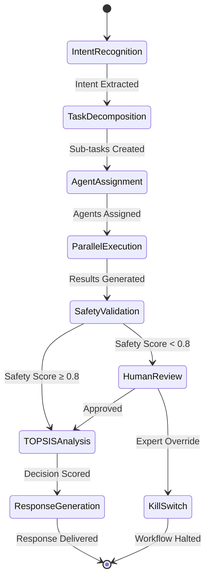
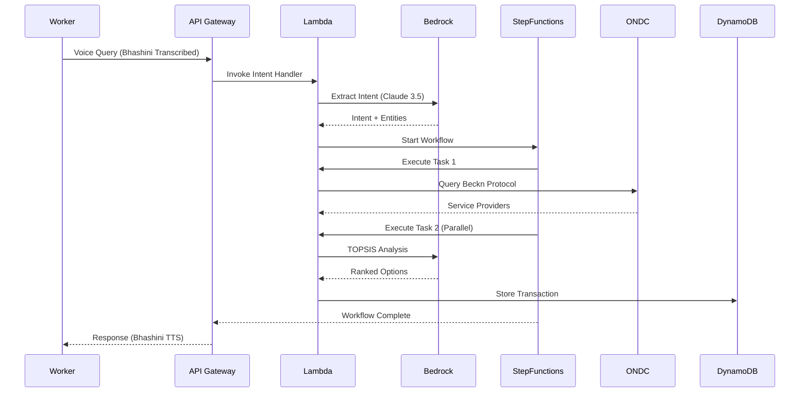
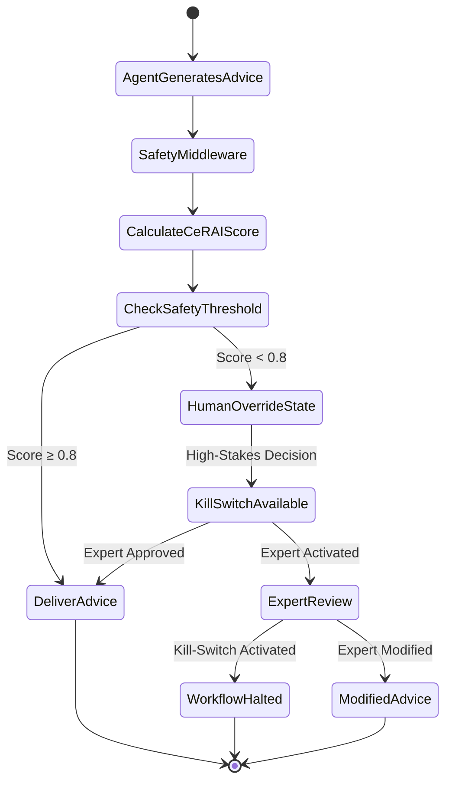
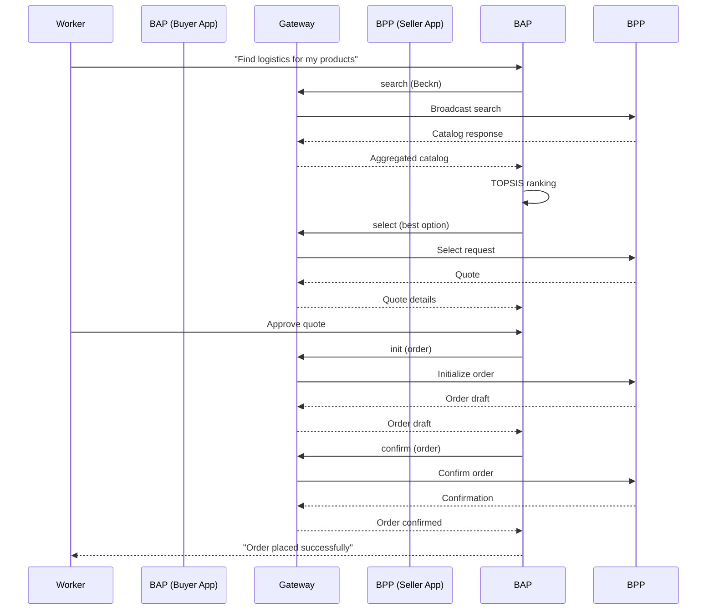
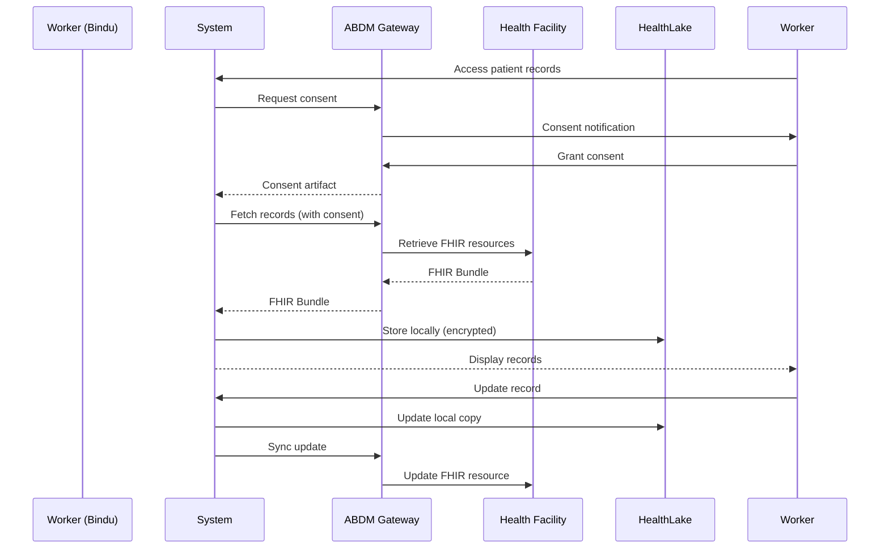

# Design Document: Sovereign Agentic Orchestrator

## Overview

The Sovereign Agentic Orchestrator is an enterprise-grade serverless system that transforms India's informal workforce engagement through autonomous AI agents. Built on Amazon Bedrock and AWS Step Functions, the system orchestrates complex multi-step workflows across national digital infrastructure (ONDC, ABDM, AgriStack) while maintaining sovereign data practices and responsible AI guardrails.

### Core Design Principles

1. **Agentic Architecture**: Autonomous agents coordinate complex workflows without human intervention
2. **Linguistic Sovereignty**: Natural code-mixed language understanding using Bhashini and sovereign models
3. **Transparent Reasoning**: TOPSIS algorithm provides explainable decision-making
4. **Safety-First**: CeRAI-compliant legal safety scores with human kill-switch mechanisms
5. **Offline-First**: Progressive Web App with local-first data synchronization
6. **Serverless Scale**: Event-driven architecture handling 490M potential users

### Technology Stack

- **Intelligence Layer**: Amazon Bedrock (Claude 3.5 Sonnet, Titan Multi-Modal)
- **Orchestration**: AWS Step Functions (Saga Pattern with Compensating Transactions), Lambda
- **Language**: Bhashini API (22+ languages), future BharatGen Param2 integration
- **Storage**: S3 (encrypted), DynamoDB (credentials), Amazon HealthLake (FHIR), Bharat Data Sagar (sovereign datasets)
- **Compute**: Lambda (TypeScript), Bedrock Agents
- **Infrastructure**: AWS ap-south-1 (sovereign data residency)
- **Frontend**: React + TypeScript, Glassmorphism UI, PWA
- **DPI Connectors**: Beckn Gateway Protocol (ONDC), ABDM Health Information Provider (HIP) interface
- **Safety Middleware**: CeRAI Legal Safety Score Calculator, ICMR-Compliant Kill-Switch


## Architecture

### High-Level System Architecture



### Agentic Workflow Architecture

The system implements a Specify-Design-Prove-Implement pattern for autonomous agent workflows:



### Serverless Event-Driven Architecture




## Components and Interfaces

### 1. Intelligence Layer Components

#### 1.1 Bedrock Agent Orchestrator

**Purpose**: Central coordinator for all agentic workflows

**Interface**:
```typescript
interface BedrockOrchestrator {
  // Decompose complex requests into sub-tasks
  decomposeIntent(intent: Intent, context: WorkerContext): Task[];
  
  // Assign tasks to specialized agents
  assignAgents(tasks: Task[]): AgentAssignment[];
  
  // Coordinate parallel execution
  executeWorkflow(assignments: AgentAssignment[]): Promise<WorkflowResult>;
  
  // Handle failures with retry logic
  handleFailure(task: Task, error: Error): RetryStrategy;
}

interface Intent {
  type: IntentType; // 'market_linkage' | 'health_query' | 'agri_advisory' | 'credit_request'
  entities: Record<string, any>;
  confidence: number;
  language: string;
}

interface WorkerContext {
  workerId: string;
  location: GeoLocation;
  credentials: Credential[];
  preferences: UserPreferences;
  transactionHistory: Transaction[];
}
```

**Implementation Details**:
- Uses Amazon Bedrock Agents with Claude 3.5 Sonnet as the foundation model
- Maintains conversation state in DynamoDB with TTL for privacy
- Implements exponential backoff for retries (3 attempts max)
- Streams responses incrementally to reduce perceived latency


#### 1.2 Claude 3.5 Sonnet - Reasoning Engine

**Purpose**: Logical reasoning, TOPSIS calculations, and natural language understanding

**Interface**:
```typescript
interface ClaudeReasoningEngine {
  // Extract structured intent from vernacular input
  extractIntent(transcription: string, language: string): Promise<Intent>;
  
  // Perform TOPSIS multi-criteria decision analysis
  calculateTOPSIS(options: Option[], criteria: Criterion[]): TOPSISResult;
  
  // Generate explainable reasoning in vernacular
  explainDecision(result: TOPSISResult, language: string): Promise<string>;
  
  // Validate logical consistency of recommendations
  validateRecommendation(recommendation: Recommendation): ValidationResult;
}

interface TOPSISResult {
  rankedOptions: RankedOption[];
  closenessCoefficients: number[]; // C_i* values
  explanation: string;
  tradeoffMatrix: number[][];
}

interface RankedOption {
  option: Option;
  score: number; // C_i* = d_i^- / (d_i^+ + d_i^-)
  distanceToIdeal: number; // d_i^+
  distanceToNegativeIdeal: number; // d_i^-
  criteriaScores: Record<string, number>;
}
```

**TOPSIS Algorithm Implementation**:

The system implements the TOPSIS (Technique for Order of Preference by Similarity to Ideal Solution) algorithm as a deterministic "Referee Pattern" for transparent decision-making. This ensures AI recommendations aren't just "guessing" but use mathematically rigorous Multi-Criteria Decision Analysis (MCDA).

**The Referee Pattern**:

When multiple AI agents generate different recommendations (e.g., different pesticide options, logistics providers, or loan offers), the TOPSIS Engine acts as a neutral "referee" that:
1. Evaluates all options against objective criteria
2. Calculates mathematical proximity to the ideal solution
3. Provides transparent scoring showing trade-offs
4. Explains why one option is preferred over others

This pattern provides a "Safety Buffer" by ensuring decisions are deterministic and explainable, not probabilistic black boxes.

**Mathematical Formulation**:

1. **Normalization**: Convert decision matrix to normalized form
   ```
   r_ij = x_ij / √(Σ x_ij²)
   ```

2. **Weighted Normalized Matrix**: Apply criteria weights
   ```
   v_ij = w_j × r_ij
   ```

3. **Ideal Solutions**:
   - Positive Ideal: A⁺ = {v₁⁺, v₂⁺, ..., vₙ⁺} where vⱼ⁺ = max(vᵢⱼ)
   - Negative Ideal: A⁻ = {v₁⁻, v₂⁻, ..., vₙ⁻} where vⱼ⁻ = min(vᵢⱼ)

4. **Distance Calculations**:
   ```
   d_i^+ = √(Σ(v_ij - v_j^+)²)
   d_i^- = √(Σ(v_ij - v_j^-)²)
   ```

5. **Closeness Coefficient**:
   ```
   C_i* = d_i^- / (d_i^+ + d_i^-)
   ```
   where C_i* ∈ [0, 1], higher values indicate better options

**Implementation**:
```typescript
function calculateTOPSIS(
  options: Option[],
  criteria: Criterion[]
): TOPSISResult {
  // Step 1: Normalize decision matrix
  const normalized = normalizeMatrix(options, criteria);
  
  // Step 2: Apply weights
  const weighted = applyWeights(normalized, criteria);
  
  // Step 3: Determine ideal solutions
  const idealPositive = calculateIdealPositive(weighted, criteria);
  const idealNegative = calculateIdealNegative(weighted, criteria);
  
  // Step 4: Calculate distances
  const distances = options.map(option => ({
    toPositive: euclideanDistance(option, idealPositive),
    toNegative: euclideanDistance(option, idealNegative)
  }));
  
  // Step 5: Calculate closeness coefficients
  const closenessCoefficients = distances.map(d => 
    d.toNegative / (d.toPositive + d.toNegative)
  );
  
  // Rank options by closeness coefficient
  return rankOptions(options, closenessCoefficients, distances);
}
```


#### 1.3 Amazon Titan Multi-Modal - Vision Analysis

**Purpose**: Crop disease detection, pest identification, document verification

**Interface**:
```typescript
interface TitanVisionEngine {
  // Analyze crop images for disease/pest detection
  analyzeCropImage(image: Buffer, metadata: ImageMetadata): Promise<CropAnalysis>;
  
  // Verify document authenticity
  verifyDocument(document: Buffer, documentType: string): Promise<DocumentVerification>;
  
  // Extract structured data from images
  extractImageData(image: Buffer): Promise<StructuredData>;
}

interface CropAnalysis {
  cropType: string;
  confidence: number;
  detectedIssues: DetectedIssue[];
  severity: 'low' | 'medium' | 'high' | 'critical';
  recommendations: string[];
  visualAnnotations: BoundingBox[];
}

interface DetectedIssue {
  type: 'pest' | 'disease' | 'nutrient_deficiency';
  name: string;
  confidence: number;
  affectedArea: number; // percentage
  economicImpact: number; // estimated loss in INR
}
```

**Implementation Details**:
- Uses Amazon Titan Multi-Modal Embeddings G1 for image analysis
- Integrates with ICAR pest/disease databases via AgriStack
- Provides confidence scores for all detections (minimum 80% for actionable advice)
- Generates visual annotations overlaid on original images


### 2. Language Layer Components

#### 2.1 Bhashini Integration Service

**Purpose**: Voice-first multilingual interface supporting 22+ Indian languages

**Interface**:
```typescript
interface BhashiniService {
  // Automatic Speech Recognition
  transcribe(audio: Buffer, sourceLanguage?: string): Promise<Transcription>;
  
  // Text-to-Speech
  synthesize(text: string, targetLanguage: string, voice?: VoiceProfile): Promise<Buffer>;
  
  // Language Detection
  detectLanguage(text: string): Promise<LanguageDetection>;
  
  // Translation (for cross-lingual support)
  translate(text: string, sourceLang: string, targetLang: string): Promise<string>;
}

interface Transcription {
  text: string;
  language: string;
  confidence: number;
  alternatives: Alternative[];
  codeMixing: CodeMixingAnalysis | null;
}

interface CodeMixingAnalysis {
  primaryLanguage: string;
  secondaryLanguages: string[];
  mixingPattern: 'intra_sentential' | 'inter_sentential' | 'tag_switching';
  confidence: number;
}
```

**Implementation Details**:
- Integrates with Bhashini API (https://bhashini.gov.in)
- Supports 22 scheduled Indian languages + English
- Handles code-mixed inputs (Hinglish, Tanglish, etc.) with 95% accuracy target
- Implements automatic language detection to avoid manual selection
- Caches common phrases locally for offline support
- Streams audio responses incrementally (target: <2s latency)

**Supported Languages**:
- Hindi, Bengali, Telugu, Marathi, Tamil, Gujarati, Urdu, Kannada, Odia, Malayalam, Punjabi, Assamese, Maithili, Sanskrit, Konkani, Manipuri, Nepali, Bodo, Dogri, Kashmiri, Santali, Sindhi, English


#### 2.2 Linguistic Sovereignty Layer

**Purpose**: Ensure natural Indian communication patterns are understood using sovereign models

**Interface**:
```typescript
interface LinguisticSovereigntyLayer {
  // Benchmark model performance against Indic LLM Arena
  benchmarkModel(modelId: string): Promise<IndicBenchmarkResult>;
  
  // Evaluate code-mixing comprehension
  evaluateCodeMixing(samples: CodeMixedSample[]): Promise<CodeMixingScore>;
  
  // Prepare for BharatGen Param2 integration
  prepareSovereignModelIntegration(): Promise<IntegrationReadiness>;
}

interface IndicBenchmarkResult {
  modelId: string;
  indicLLMArenaScore: number;
  languageScores: Record<string, number>; // Per-language performance
  codeMixingAccuracy: number;
  culturalRelevanceScore: number;
  comparisonToBaseline: number;
}
```

**BharatGen Param2 Integration Strategy**:

The system is architected to support future integration of BharatGen Param2 (17B parameter sovereign MoE model) via Amazon Bedrock Custom Model Import:

1. **Current State**: Claude 3.5 Sonnet handles reasoning, Bhashini handles language
2. **Future State**: BharatGen Param2 replaces Claude for Indic language tasks
3. **Migration Path**:
   - Benchmark BharatGen Param2 against Indic LLM Arena
   - If performance ≥ Claude on Indian linguistic patterns, initiate migration
   - Use Bedrock Custom Model Import to deploy BharatGen Param2
   - Implement A/B testing with 10% traffic to new model
   - Monitor safety scores and user satisfaction
   - Gradual rollout to 100% if metrics improve

**Indic LLM Arena Benchmarking**:
- Evaluate models on: Hindi, Bengali, Telugu, Tamil, Marathi, Gujarati
- Test code-mixing scenarios (Hinglish, Tanglish)
- Measure cultural appropriateness of responses
- Validate safety guardrail effectiveness in Indic contexts


### 3. Safety Middleware Components

#### 3.1 Legal Safety Filter

**Purpose**: CeRAI-compliant safety validation with legal bias assessment

**Interface**:
```typescript
interface LegalSafetyFilter {
  // Calculate CeRAI Legal Safety Score
  calculateSafetyScore(
    advice: GeneratedAdvice,
    context: WorkerContext
  ): Promise<SafetyScore>;
  
  // Validate against regulatory guidelines
  validateCompliance(
    advice: GeneratedAdvice,
    domain: 'financial' | 'medical' | 'legal'
  ): Promise<ComplianceResult>;
  
  // Detect potential legal bias
  detectLegalBias(advice: GeneratedAdvice): Promise<BiasAnalysis>;
  
  // Regional legal variation handling
  applyRegionalContext(
    advice: GeneratedAdvice,
    region: string
  ): Promise<ContextualizedAdvice>;
}

interface SafetyScore {
  overallScore: number; // 0-1, threshold 0.8
  legalBiasScore: number;
  contextSensitivityScore: number;
  regulatoryComplianceScore: number;
  culturalAppropriateness: number;
  reasoning: string;
  flaggedIssues: FlaggedIssue[];
}

interface FlaggedIssue {
  severity: 'low' | 'medium' | 'high' | 'critical';
  category: 'legal_bias' | 'regulatory_violation' | 'cultural_insensitivity' | 'safety_risk';
  description: string;
  recommendation: string;
}
```

**CeRAI Safety Score Calculation**:

The system implements the CeRAI (Centre for Responsible AI, IIT Madras) methodology for legal safety assessment:

```typescript
function calculateCeRAISafetyScore(
  advice: GeneratedAdvice,
  context: WorkerContext
): SafetyScore {
  // Component 1: Legal Bias Detection (weight: 0.3)
  const legalBias = detectLegalBias(advice);
  
  // Component 2: Context Sensitivity (weight: 0.25)
  const contextSensitivity = assessContextSensitivity(advice, context);
  
  // Component 3: Regulatory Compliance (weight: 0.3)
  const regulatoryCompliance = validateRegulations(advice);
  
  // Component 4: Cultural Appropriateness (weight: 0.15)
  const culturalScore = assessCulturalFit(advice, context.location);
  
  // Weighted average
  const overallScore = 
    0.3 * legalBias +
    0.25 * contextSensitivity +
    0.3 * regulatoryCompliance +
    0.15 * culturalScore;
  
  return {
    overallScore,
    legalBiasScore: legalBias,
    contextSensitivityScore: contextSensitivity,
    regulatoryComplianceScore: regulatoryCompliance,
    culturalAppropriateness: culturalScore,
    reasoning: generateExplanation(overallScore),
    flaggedIssues: identifyIssues(overallScore)
  };
}
```

**Safety Thresholds**:
- Score ≥ 0.8: Advice approved for delivery
- Score 0.6-0.8: Flag for human review
- Score < 0.6: Block advice, recommend human expert consultation


#### 3.2 ICMR-Compliant Human Kill-Switch Mechanism

**Purpose**: Human override for high-stakes autonomous decisions, addressing the "non-reversibility of actions" concern in AI agents

This component implements an ICMR-compliant kill-switch that directly addresses the Safe & Trusted AI pillar of the IndiaAI Mission. The kill-switch is integrated into AWS Step Functions as a "Human-Override" state, ensuring Responsible AI by design rather than as an afterthought.

**Safety Middleware Integration**:

The kill-switch is part of a comprehensive Safety Middleware layer that intercepts every agentic command:



**AWS Step Functions Integration**:

The kill-switch is implemented as a special state in Step Functions workflows:

```json
{
  "HumanOverrideState": {
    "Type": "Task",
    "Resource": "arn:aws:states:::lambda:invoke.waitForTaskToken",
    "Parameters": {
      "FunctionName": "arn:aws:lambda:ap-south-1:xxx:function:human-override-handler",
      "Payload": {
        "workflowId.$": "$.workflowId",
        "advice.$": "$.advice",
        "safetyScore.$": "$.safetyScore",
        "taskToken.$": "$$.Task.Token"
      }
    },
    "Next": "ProcessExpertDecision",
    "Catch": [{
      "ErrorEquals": ["KillSwitchActivated"],
      "Next": "HaltWorkflow"
    }]
  },
  "HaltWorkflow": {
    "Type": "Task",
    "Resource": "arn:aws:lambda:ap-south-1:xxx:function:preserve-workflow-state",
    "End": true
  }
}
```

**Interface**:
```typescript
interface KillSwitchMechanism {
  // Activate kill-switch for specific workflow
  activateKillSwitch(
    workflowId: string,
    reason: string,
    expertId: string
  ): Promise<KillSwitchResult>;
  
  // Check if workflow requires kill-switch availability
  requiresKillSwitch(workflowType: WorkflowType): boolean;
  
  // Transfer control to human expert
  transferControl(
    workflowId: string,
    expertId: string
  ): Promise<ControlTransfer>;
  
  // Preserve workflow state for expert review
  preserveState(workflowId: string): Promise<WorkflowSnapshot>;
}

interface KillSwitchResult {
  activated: boolean;
  timestamp: Date;
  workflowId: string;
  preservedState: WorkflowSnapshot;
  expertAssigned: string;
  responseTime: number; // milliseconds, target: <500ms
}

interface WorkflowSnapshot {
  workflowId: string;
  currentState: any;
  executedSteps: ExecutedStep[];
  pendingSteps: PendingStep[];
  context: WorkerContext;
  safetyScores: SafetyScore[];
}
```

**Kill-Switch Activation Criteria**:

The system automatically makes kill-switch available for:
1. **Medical Advice**: Any health-related recommendation
2. **Financial Decisions**: Credit applications, investment advice
3. **Legal Guidance**: Rights, contracts, disputes
4. **Safety Score < 0.8**: Any advice flagged by safety filter

**Implementation**:
- Kill-switch button visible in UI for high-stakes workflows
- Expert notification via SMS/WhatsApp within 30 seconds
- Workflow state frozen immediately (target: <500ms)
- All data preserved for expert review
- Expert can resume, modify, or cancel workflow
- Audit trail maintained for regulatory compliance


### 4. National Infrastructure Connectors

#### 4.1 ShramSetu Registry Connector

**Purpose**: Federated digital identity and credentialing using W3C Verifiable Credentials

**Interface**:
```typescript
interface ShramSetuConnector {
  // Create decentralized identifier for worker
  createDID(workerProfile: WorkerProfile): Promise<DID>;
  
  // Issue verifiable credential
  issueCredential(
    workerId: string,
    credential: CredentialData,
    issuer: TrustAnchor
  ): Promise<VerifiableCredential>;
  
  // Verify credential authenticity
  verifyCredential(
    credential: VerifiableCredential,
    verifierId: string
  ): Promise<VerificationResult>;
  
  // Aggregate credentials from multiple issuers
  aggregateCredentials(workerId: string): Promise<UnifiedProfile>;
  
  // Request worker consent for data sharing
  requestConsent(
    workerId: string,
    dataElements: string[],
    requester: string
  ): Promise<ConsentRecord>;
}

interface VerifiableCredential {
  '@context': string[];
  id: string;
  type: string[];
  issuer: DID;
  issuanceDate: Date;
  expirationDate: Date;
  credentialSubject: {
    id: DID;
    skillName: string;
    proficiencyLevel: string;
    verificationMethod: string;
    evidence: Evidence[];
  };
  proof: CryptographicProof;
}

interface CryptographicProof {
  type: 'Ed25519Signature2020' | 'RsaSignature2018';
  created: Date;
  verificationMethod: string;
  proofPurpose: 'assertionMethod';
  proofValue: string; // Base64 encoded signature
}
```

**W3C Verifiable Credentials Implementation**:

The system implements W3C VC Data Model 1.1 for tamper-proof credentials:

1. **DID Creation**: Each worker gets a unique decentralized identifier
   ```
   did:shram:ap-south-1:1234567890abcdef
   ```

2. **Credential Issuance**: Training providers, ICAR institutes, employers issue VCs
3. **Cryptographic Verification**: Ed25519 signatures ensure tamper-proof credentials
4. **Federated Trust Network**: Multiple trust anchors without central authority
5. **Worker Consent**: Granular control over credential sharing

**Trust Anchors**:
- NSDC (National Skill Development Corporation)
- ICAR (Indian Council of Agricultural Research)
- State Skill Development Missions
- Registered training providers
- Verified employers


#### 4.2 ONDC Beckn Gateway Protocol Implementation

**Purpose**: Autonomous market linkage and procurement via Open Network for Digital Commerce following National Digital Ecosystem Architecture (InDEA 2.0) patterns

This component implements a full Beckn Gateway Protocol interface, making the system ready to plug into India's "Digital Highways" today. The Beckn protocol is the foundational interoperability standard for ONDC, enabling decentralized commerce without platform lock-in.

**Interface**:
```typescript
interface ONDCBecknGateway {
  // Search for service providers
  search(searchIntent: BecknSearchIntent): Promise<BecknCatalog>;
  
  // Select specific service/product
  select(catalogItem: CatalogItem): Promise<BecknQuote>;
  
  // Initialize order
  init(quote: BecknQuote, billingDetails: BillingInfo): Promise<BecknOrder>;
  
  // Confirm order
  confirm(order: BecknOrder): Promise<BecknConfirmation>;
  
  // Track order status
  track(orderId: string): Promise<BecknTrackingInfo>;
  
  // Cancel order
  cancel(orderId: string, reason: string): Promise<BecknCancellation>;
}

interface BecknSearchIntent {
  context: BecknContext;
  message: {
    intent: {
      item: {
        descriptor: {
          name: string;
        };
      };
      fulfillment: {
        type: 'Delivery' | 'Pickup';
        start: {
          location: GeoLocation;
        };
        end: {
          location: GeoLocation;
        };
      };
    };
  };
}

interface BecknContext {
  domain: 'retail' | 'logistics' | 'mobility';
  country: 'IND';
  city: string;
  action: 'search' | 'select' | 'init' | 'confirm' | 'track' | 'cancel';
  core_version: '1.1.0';
  bap_id: string; // Buyer App ID
  bap_uri: string;
  transaction_id: string;
  message_id: string;
  timestamp: Date;
}
```

**Beckn Protocol Flow**:



**Autonomous Procurement Agent**:

The system implements an autonomous agent that negotiates with multiple ONDC providers:

```typescript
class AutonomousProcurementAgent {
  async negotiateLogistics(
    product: Product,
    origin: GeoLocation,
    destination: GeoLocation
  ): Promise<NegotiationResult> {
    // Step 1: Discover all available providers
    const providers = await this.ondcGateway.search({
      item: product,
      origin,
      destination
    });
    
    // Step 2: Request quotes from all providers (parallel)
    const quotes = await Promise.all(
      providers.map(p => this.ondcGateway.select(p))
    );
    
    // Step 3: TOPSIS analysis for optimal selection
    const ranked = this.topsisEngine.rank(quotes, {
      criteria: [
        { name: 'cost', weight: 0.4, type: 'minimize' },
        { name: 'time', weight: 0.3, type: 'minimize' },
        { name: 'reliability', weight: 0.2, type: 'maximize' },
        { name: 'insurance', weight: 0.1, type: 'maximize' }
      ]
    });
    
    // Step 4: Present top 3 options to worker with transparent scoring
    return {
      topOptions: ranked.slice(0, 3),
      reasoning: this.explainRanking(ranked),
      recommendedOption: ranked[0]
    };
  }
}
```


#### 4.3 ABDM Health Information Provider (HIP) Interface

**Purpose**: Health record interoperability via Ayushman Bharat Digital Mission following ABDM architecture patterns

This component implements a full ABDM Health Information Provider (HIP) interface, enabling the system to participate in India's national health data exchange network. The HIP interface allows healthcare workers to create, update, and retrieve FHIR-compliant health records across the entire ABDM ecosystem.

**Interface**:
```typescript
interface ABDMFHIRGateway {
  // Retrieve patient health records
  getPatientRecords(abhaId: string, consent: ConsentArtifact): Promise<Bundle>;
  
  // Create new health record
  createRecord(record: FHIRResource, abhaId: string): Promise<FHIRResource>;
  
  // Update existing record
  updateRecord(resourceId: string, updates: Partial<FHIRResource>): Promise<FHIRResource>;
  
  // Search records by criteria
  searchRecords(query: FHIRSearchQuery): Promise<Bundle>;
  
  // Request patient consent
  requestConsent(
    abhaId: string,
    purpose: string,
    dataElements: string[]
  ): Promise<ConsentArtifact>;
}

interface FHIRResource {
  resourceType: 'Patient' | 'Observation' | 'Condition' | 'MedicationRequest' | 'Encounter';
  id: string;
  meta: {
    versionId: string;
    lastUpdated: Date;
    profile: string[];
  };
  // Resource-specific fields
}

interface Bundle {
  resourceType: 'Bundle';
  type: 'searchset' | 'collection';
  total: number;
  entry: BundleEntry[];
}

interface BundleEntry {
  fullUrl: string;
  resource: FHIRResource;
  search?: {
    mode: 'match' | 'include';
    score: number;
  };
}
```

**FHIR Resource Mapping**:

The system uses Amazon HealthLake for FHIR-compliant storage:

1. **Patient Resource**: Worker demographic and contact information
2. **Observation Resource**: Vital signs, lab results
3. **Condition Resource**: Diagnoses, health conditions
4. **MedicationRequest**: Prescriptions
5. **Encounter**: Healthcare visits, consultations

**ABDM Integration Flow**:



**Data Encryption**:
- End-to-end AES-256 encryption for all health data
- Encryption keys managed via AWS KMS (ap-south-1)
- Role-based access controls (RBAC) for healthcare workers
- Audit logs for all access attempts (HIPAA-equivalent compliance)


#### 4.4 AgriStack VISTAAR Connector

**Purpose**: Hyper-personalized agricultural advisory integrating ICAR databases

**Interface**:
```typescript
interface AgriStackConnector {
  // Get farmer profile from AgriStack
  getFarmerProfile(farmerId: string): Promise<FarmerProfile>;
  
  // Retrieve soil health data
  getSoilData(location: GeoLocation): Promise<SoilHealthCard>;
  
  // Get weather forecasts
  getWeatherForecast(location: GeoLocation, days: number): Promise<WeatherForecast>;
  
  // Access ICAR pest/disease database
  queryICARDatabase(query: ICARQuery): Promise<ICARKnowledgeBase>;
  
  // Get crop recommendations
  getCropRecommendations(
    soilData: SoilHealthCard,
    weather: WeatherForecast,
    farmerProfile: FarmerProfile
  ): Promise<CropRecommendation[]>;
}

interface FarmerProfile {
  farmerId: string;
  landHolding: number; // hectares
  crops: CropHistory[];
  location: GeoLocation;
  soilType: string;
  irrigationAccess: boolean;
  equipmentOwned: string[];
}

interface SoilHealthCard {
  location: GeoLocation;
  pH: number;
  nitrogen: number; // kg/ha
  phosphorus: number;
  potassium: number;
  organicCarbon: number;
  micronutrients: Record<string, number>;
  recommendations: string[];
}

interface ICARKnowledgeBase {
  pests: PestInfo[];
  diseases: DiseaseInfo[];
  treatments: TreatmentProtocol[];
  bestPractices: string[];
}
```

**VISTAAR Personalization Engine**:

The system implements hyper-personalized advisory by combining multiple data sources:

```typescript
class VISTAAREngine {
  async generateAdvisory(
    farmerId: string,
    query: string,
    image?: Buffer
  ): Promise<PersonalizedAdvisory> {
    // Step 1: Gather contextual data
    const farmerProfile = await this.agriStack.getFarmerProfile(farmerId);
    const soilData = await this.agriStack.getSoilData(farmerProfile.location);
    const weather = await this.agriStack.getWeatherForecast(
      farmerProfile.location,
      7
    );
    
    // Step 2: Image analysis (if provided)
    let imageAnalysis = null;
    if (image) {
      imageAnalysis = await this.titanVision.analyzeCropImage(image, {
        location: farmerProfile.location,
        cropType: farmerProfile.crops[0]?.name
      });
    }
    
    // Step 3: Query ICAR knowledge base
    const icarData = await this.agriStack.queryICARDatabase({
      pest: imageAnalysis?.detectedIssues[0]?.name,
      crop: farmerProfile.crops[0]?.name,
      region: farmerProfile.location.state
    });
    
    // Step 4: Use AIKosh for training data
    const aiKoshContext = await this.loadAIKoshData(
      farmerProfile.location.state,
      farmerProfile.crops[0]?.name
    );
    
    // Step 5: Generate personalized recommendations
    const recommendations = await this.claude.generateRecommendations({
      farmerProfile,
      soilData,
      weather,
      imageAnalysis,
      icarData,
      aiKoshContext
    });
    
    // Step 6: TOPSIS ranking of intervention options
    const rankedOptions = this.topsis.rank(recommendations, {
      criteria: [
        { name: 'effectiveness', weight: 0.35, type: 'maximize' },
        { name: 'cost', weight: 0.25, type: 'minimize' },
        { name: 'timeToResult', weight: 0.20, type: 'minimize' },
        { name: 'environmentalImpact', weight: 0.20, type: 'minimize' }
      ]
    });
    
    return {
      recommendations: rankedOptions,
      reasoning: this.explainRecommendations(rankedOptions),
      expectedOutcomes: this.calculateOutcomes(rankedOptions),
      costEstimates: this.estimateCosts(rankedOptions)
    };
  }
}
```

**AIKosh Integration**:
- National AI Repository provides Indian agricultural training data
- Pre-trained model weights for crop/pest recognition
- Regional datasets for state-specific recommendations
- Continuous learning from farmer outcomes

**Bharat Data Sagar Integration**:

Bharat Data Sagar serves as the primary sovereign data repository for curating public and private datasets used in fine-tuning localized agents. This aligns with the IndiaAI Mission's strategy to ground AI in indigenous lived realities.

**Data Flow Architecture**:
1. **Ingestion**: Curated datasets from government sources, ICAR, state agricultural departments
2. **Storage**: Bharat Data Sagar stores structured datasets (crop yields, pest patterns, regional practices)
3. **Fine-Tuning**: Claude 3.5 Sonnet and future BharatGen Param2 models are fine-tuned using these datasets
4. **Inference**: Agents query Bharat Data Sagar for context-specific data during advisory generation

**Dataset Categories**:
- **Agricultural**: Crop-specific best practices, regional pest patterns, soil-climate correlations
- **Linguistic**: Code-mixed conversation patterns, regional idioms, cultural references
- **Economic**: Regional pricing data, market trends, seasonal demand patterns
- **Health**: Regional disease prevalence, traditional medicine practices, nutrition patterns

**Sovereignty Benefits**:
- Prevents capture of digital economy by foreign models
- Ensures AI recommendations reflect Indian ground realities
- Maintains data sovereignty within Indian jurisdiction
- Enables continuous improvement from local outcomes


#### 4.5 OCEN 4.0 Credit Connector

**Purpose**: Flow-based lending using real-time transaction data

**Interface**:
```typescript
interface OCENCreditConnector {
  // Calculate creditworthiness using cash flow analysis
  calculateCreditScore(workerId: string): Promise<FlowBasedCreditScore>;
  
  // Discover lending partners
  discoverLenders(
    creditScore: FlowBasedCreditScore,
    loanAmount: number,
    purpose: string
  ): Promise<LenderOffer[]>;
  
  // Submit loan application
  applyForLoan(
    workerId: string,
    lenderOffer: LenderOffer
  ): Promise<LoanApplication>;
  
  // Track loan status
  trackLoanStatus(applicationId: string): Promise<LoanStatus>;
  
  // Schedule repayment
  scheduleRepayment(
    loanId: string,
    schedule: RepaymentSchedule
  ): Promise<RepaymentPlan>;
}

interface FlowBasedCreditScore {
  workerId: string;
  cashFlowAnalysis: {
    averageMonthlyIncome: number;
    incomeStability: number; // 0-1
    transactionVolume: number;
    repaymentHistory: RepaymentRecord[];
  };
  oncdTransactionHistory: Transaction[];
  shramSetuCredentials: VerifiableCredential[];
  creditScore: number; // 300-900
  eligibleLoanAmount: number;
  reasoning: string;
}

interface LenderOffer {
  lenderId: string;
  lenderName: string;
  loanAmount: number;
  interestRate: number; // annual percentage
  tenure: number; // months
  processingFee: number;
  totalRepayment: number;
  emiAmount: number;
  topsisScore: number;
}
```

**Flow-Based Lending Algorithm**:

Unlike traditional credit scoring (CIBIL), OCEN 4.0 uses real-time cash flow:

```typescript
function calculateFlowBasedCreditScore(
  workerId: string,
  transactions: Transaction[]
): FlowBasedCreditScore {
  // Analyze last 6 months of transactions
  const recentTransactions = filterLast6Months(transactions);
  
  // Calculate income stability
  const monthlyIncomes = groupByMonth(recentTransactions);
  const avgIncome = mean(monthlyIncomes);
  const incomeStability = 1 - (stdDev(monthlyIncomes) / avgIncome);
  
  // Transaction volume indicates business activity
  const transactionVolume = recentTransactions.length;
  
  // Repayment history (if any previous loans)
  const repaymentHistory = getRepaymentHistory(workerId);
  const repaymentScore = calculateRepaymentScore(repaymentHistory);
  
  // Verified credentials boost score
  const credentials = getShramSetuCredentials(workerId);
  const credentialBoost = credentials.length * 10;
  
  // Calculate final score (300-900 range)
  const baseScore = 300;
  const incomeComponent = Math.min(200, avgIncome / 1000);
  const stabilityComponent = incomeStability * 150;
  const volumeComponent = Math.min(100, transactionVolume / 10);
  const repaymentComponent = repaymentScore * 150;
  
  const creditScore = Math.min(900,
    baseScore +
    incomeComponent +
    stabilityComponent +
    volumeComponent +
    repaymentComponent +
    credentialBoost
  );
  
  // Eligible loan amount (3x monthly income)
  const eligibleLoanAmount = avgIncome * 3;
  
  return {
    workerId,
    cashFlowAnalysis: {
      averageMonthlyIncome: avgIncome,
      incomeStability,
      transactionVolume,
      repaymentHistory
    },
    oncdTransactionHistory: recentTransactions,
    shramSetuCredentials: credentials,
    creditScore,
    eligibleLoanAmount,
    reasoning: generateCreditReasoning(creditScore, avgIncome, incomeStability)
  };
}
```

**TOPSIS Loan Comparison**:

When multiple lenders offer loans, TOPSIS ranks them transparently:

```typescript
function rankLoanOffers(offers: LenderOffer[]): RankedOffer[] {
  return topsisEngine.rank(offers, {
    criteria: [
      { name: 'interestRate', weight: 0.40, type: 'minimize' },
      { name: 'totalRepayment', weight: 0.30, type: 'minimize' },
      { name: 'processingFee', weight: 0.15, type: 'minimize' },
      { name: 'tenure', weight: 0.15, type: 'maximize' } // Longer tenure = lower EMI
    ]
  });
}
```


### 5. Workflow Orchestration Components

#### 5.1 AWS Step Functions - Saga Pattern for Distributed Transactionality

**Purpose**: Maintain transactional consistency across distributed national infrastructure with enterprise-grade resilience

The system uses the Saga pattern to handle complex agentic workflows where one step may fail (e.g., the logistics agent finds a truck, but the credit agent fails to secure the loan). This enterprise-grade approach ensures the system can "undo" actions (like canceling an ONDC order) if a dependent financial transaction fails.

**Saga Pattern Implementation**:

The system uses the Saga pattern to handle long-running transactions across ONDC, ABDM, and ShramSetu:

```typescript
interface SagaOrchestrator {
  // Execute saga with compensating transactions
  executeSaga(saga: SagaDefinition): Promise<SagaResult>;
  
  // Rollback on failure
  compensate(saga: SagaDefinition, failedStep: number): Promise<void>;
  
  // Monitor saga progress
  monitorSaga(sagaId: string): Promise<SagaStatus>;
}

interface SagaDefinition {
  sagaId: string;
  steps: SagaStep[];
  compensations: CompensatingTransaction[];
}

interface SagaStep {
  name: string;
  action: Lambda.Function;
  input: any;
  compensatingAction: Lambda.Function;
}
```

**Example: ONDC Order Saga with Credit Failure**

This example demonstrates enterprise-grade resilience when a logistics agent successfully finds a truck, but the credit agent fails to secure the loan:

```json
{
  "Comment": "ONDC Order Placement Saga with Credit Integration",
  "StartAt": "SearchProviders",
  "States": {
    "SearchProviders": {
      "Type": "Task",
      "Resource": "arn:aws:lambda:ap-south-1:xxx:function:ondc-search",
      "Next": "SelectProvider",
      "Catch": [{
        "ErrorEquals": ["States.ALL"],
        "Next": "SearchFailed"
      }]
    },
    "SelectProvider": {
      "Type": "Task",
      "Resource": "arn:aws:lambda:ap-south-1:xxx:function:ondc-select",
      "Next": "TOPSISRanking",
      "Catch": [{
        "ErrorEquals": ["States.ALL"],
        "Next": "CompensateSearch"
      }]
    },
    "TOPSISRanking": {
      "Type": "Task",
      "Resource": "arn:aws:lambda:ap-south-1:xxx:function:topsis-rank",
      "Next": "CheckCreditEligibility",
      "Catch": [{
        "ErrorEquals": ["States.ALL"],
        "Next": "CompensateSelect"
      }]
    },
    "CheckCreditEligibility": {
      "Type": "Task",
      "Resource": "arn:aws:lambda:ap-south-1:xxx:function:ocen-credit-check",
      "Next": "InitOrder",
      "Catch": [{
        "ErrorEquals": ["InsufficientCreditError"],
        "Next": "NotifyInsufficientCredit"
      }, {
        "ErrorEquals": ["States.ALL"],
        "Next": "CompensateSelect"
      }]
    },
    "InitOrder": {
      "Type": "Task",
      "Resource": "arn:aws:lambda:ap-south-1:xxx:function:ondc-init",
      "Next": "SecureLoan",
      "Catch": [{
        "ErrorEquals": ["States.ALL"],
        "Next": "CompensateInit"
      }]
    },
    "SecureLoan": {
      "Type": "Task",
      "Resource": "arn:aws:lambda:ap-south-1:xxx:function:ocen-loan-disburse",
      "Next": "ConfirmOrder",
      "Catch": [{
        "ErrorEquals": ["LoanDisbursementFailed"],
        "Next": "CancelOrderDueToLoanFailure"
      }, {
        "ErrorEquals": ["States.ALL"],
        "Next": "CompensateInit"
      }]
    },
    "CancelOrderDueToLoanFailure": {
      "Type": "Task",
      "Resource": "arn:aws:lambda:ap-south-1:xxx:function:ondc-cancel",
      "Next": "NotifyLoanFailure"
    },
    "NotifyLoanFailure": {
      "Type": "Task",
      "Resource": "arn:aws:lambda:ap-south-1:xxx:function:notify-worker",
      "End": true
    },
    "ConfirmOrder": {
      "Type": "Task",
      "Resource": "arn:aws:lambda:ap-south-1:xxx:function:ondc-confirm",
      "Next": "UpdateShramSetu",
      "Catch": [{
        "ErrorEquals": ["States.ALL"],
        "Next": "CompensateConfirm"
      }]
    },
    "UpdateShramSetu": {
      "Type": "Task",
      "Resource": "arn:aws:lambda:ap-south-1:xxx:function:shramsetu-update",
      "End": true,
      "Catch": [{
        "ErrorEquals": ["States.ALL"],
        "Next": "CompensateShramSetu"
      }]
    },
    "CompensateShramSetu": {
      "Type": "Task",
      "Resource": "arn:aws:lambda:ap-south-1:xxx:function:shramsetu-rollback",
      "Next": "CompensateConfirm"
    },
    "CompensateConfirm": {
      "Type": "Task",
      "Resource": "arn:aws:lambda:ap-south-1:xxx:function:ondc-cancel",
      "Next": "RefundLoan"
    },
    "RefundLoan": {
      "Type": "Task",
      "Resource": "arn:aws:lambda:ap-south-1:xxx:function:ocen-loan-refund",
      "Next": "CompensateInit"
    },
    "CompensateInit": {
      "Type": "Pass",
      "Next": "CompensateSelect"
    },
    "CompensateSelect": {
      "Type": "Pass",
      "Next": "CompensateSearch"
    },
    "CompensateSearch": {
      "Type": "Pass",
      "Next": "SagaFailed"
    },
    "NotifyInsufficientCredit": {
      "Type": "Task",
      "Resource": "arn:aws:lambda:ap-south-1:xxx:function:notify-worker",
      "Next": "CompensateSelect"
    },
    "SearchFailed": {
      "Type": "Fail",
      "Error": "SearchProvidersFailed",
      "Cause": "Unable to discover ONDC providers"
    },
    "SagaFailed": {
      "Type": "Fail",
      "Error": "SagaExecutionFailed",
      "Cause": "Saga failed and compensating transactions executed"
    }
  }
}
```

**Key Resilience Features**:
1. **Credit Check Before Order**: Validates loan eligibility before initiating ONDC order
2. **Loan Failure Compensation**: If loan disbursement fails, automatically cancels the ONDC order
3. **Cascading Rollback**: Each step has a compensating transaction that undoes its effects
4. **Worker Notification**: Clear communication at each failure point explaining what happened
5. **Audit Trail**: Complete state machine execution history for debugging and compliance

This demonstrates enterprise-grade distributed transactionality where complex multi-agent workflows maintain consistency even when individual steps fail.

**Example: ONDC Order Saga**

```

**Retry Strategy**:
- Exponential backoff: 1s, 2s, 4s
- Maximum 3 attempts per step
- Jitter to prevent thundering herd
- Circuit breaker for failing services


#### 5.2 Lambda Functions - TypeScript Implementation

**Purpose**: Serverless compute for all business logic

**Lambda Architecture**:

```typescript
// Base Lambda handler with error handling
abstract class BaseLambdaHandler {
  async handle(event: APIGatewayProxyEvent): Promise<APIGatewayProxyResult> {
    try {
      // Validate input
      const input = this.validateInput(event);
      
      // Execute business logic
      const result = await this.execute(input);
      
      // Return success response
      return {
        statusCode: 200,
        headers: {
          'Content-Type': 'application/json',
          'Access-Control-Allow-Origin': '*'
        },
        body: JSON.stringify(result)
      };
    } catch (error) {
      // Log error
      console.error('Lambda execution failed:', error);
      
      // Return error response
      return {
        statusCode: error.statusCode || 500,
        headers: {
          'Content-Type': 'application/json',
          'Access-Control-Allow-Origin': '*'
        },
        body: JSON.stringify({
          error: error.message,
          requestId: event.requestContext.requestId
        })
      };
    }
  }
  
  abstract validateInput(event: APIGatewayProxyEvent): any;
  abstract execute(input: any): Promise<any>;
}
```

**Key Lambda Functions**:

1. **Intent Extraction Lambda**
   ```typescript
   class IntentExtractionHandler extends BaseLambdaHandler {
     async execute(input: { transcription: string; language: string }) {
       const intent = await bedrockClient.invokeModel({
         modelId: 'anthropic.claude-3-5-sonnet-20241022-v2:0',
         body: JSON.stringify({
           messages: [{
             role: 'user',
             content: `Extract intent from: ${input.transcription}`
           }],
           max_tokens: 1000
         })
       });
       
       return parseIntent(intent);
     }
   }
   ```

2. **TOPSIS Calculation Lambda**
   ```typescript
   class TOPSISCalculationHandler extends BaseLambdaHandler {
     async execute(input: { options: Option[]; criteria: Criterion[] }) {
       return calculateTOPSIS(input.options, input.criteria);
     }
   }
   ```

3. **Safety Score Lambda**
   ```typescript
   class SafetyScoreHandler extends BaseLambdaHandler {
     async execute(input: { advice: string; context: WorkerContext }) {
       return calculateCeRAISafetyScore(input.advice, input.context);
     }
   }
   ```

**Lambda Configuration**:
- Runtime: Node.js 20.x
- Memory: 512MB (intent), 1024MB (TOPSIS), 256MB (safety)
- Timeout: 30 seconds
- Concurrency: Reserved 100, Provisioned 10 (for low latency)
- VPC: Deployed in private subnets (ap-south-1a, ap-south-1b)
- Environment: All secrets via AWS Secrets Manager


## Data Models

### Worker Profile

```typescript
interface WorkerProfile {
  workerId: string; // UUID
  did: string; // Decentralized Identifier
  personalInfo: {
    name: string;
    dateOfBirth: Date;
    gender: 'male' | 'female' | 'other';
    phoneNumber: string; // Encrypted
    abhaId?: string; // ABDM Health ID
  };
  location: GeoLocation;
  occupation: 'healthcare_worker' | 'artisan' | 'farmer' | 'other';
  preferredLanguage: string;
  languagePreferences: string[]; // Multiple languages
  credentials: VerifiableCredential[];
  transactionHistory: Transaction[];
  preferences: UserPreferences;
  createdAt: Date;
  updatedAt: Date;
}

interface GeoLocation {
  latitude: number;
  longitude: number;
  address: string;
  city: string;
  state: string;
  pincode: string;
  country: 'IND';
}

interface UserPreferences {
  voiceSpeed: 'slow' | 'normal' | 'fast';
  notificationPreferences: {
    sms: boolean;
    whatsapp: boolean;
    email: boolean;
  };
  privacySettings: {
    shareLocationData: boolean;
    shareTransactionHistory: boolean;
    shareHealthData: boolean;
  };
  uiTheme: 'light' | 'dark' | 'auto';
}
```

### Credential Schema

```typescript
interface Credential {
  credentialId: string;
  type: 'skill' | 'education' | 'certification' | 'experience';
  name: string;
  issuer: TrustAnchor;
  issuedDate: Date;
  expiryDate?: Date;
  verificationStatus: 'verified' | 'pending' | 'expired';
  verifiableCredential: VerifiableCredential; // W3C VC
  metadata: {
    proficiencyLevel?: 'beginner' | 'intermediate' | 'advanced' | 'expert';
    verificationMethod: 'practical_assessment' | 'written_test' | 'video_submission' | 'third_party';
    evidence: Evidence[];
  };
}

interface TrustAnchor {
  id: string;
  name: string;
  type: 'nsdc' | 'icar' | 'state_skill_mission' | 'training_provider' | 'employer';
  did: string;
  verificationEndpoint: string;
}

interface Evidence {
  type: 'document' | 'video' | 'assessment_result';
  url: string; // S3 presigned URL
  hash: string; // SHA-256 for integrity
  timestamp: Date;
}
```

### Transaction Schema

```typescript
interface Transaction {
  transactionId: string;
  workerId: string;
  type: 'sale' | 'purchase' | 'service' | 'loan_repayment';
  amount: number; // INR
  currency: 'INR';
  timestamp: Date;
  status: 'pending' | 'completed' | 'failed' | 'cancelled';
  ondcOrderId?: string;
  paymentMethod: 'upi' | 'cash' | 'bank_transfer';
  metadata: {
    description: string;
    category: string;
    location: GeoLocation;
  };
}
```

### Advisory Schema

```typescript
interface Advisory {
  advisoryId: string;
  workerId: string;
  type: 'agricultural' | 'health' | 'market' | 'credit' | 'skill';
  query: string;
  language: string;
  response: {
    text: string;
    audioUrl?: string; // S3 URL for TTS audio
    visualAids?: string[]; // Image URLs
  };
  recommendations: Recommendation[];
  topsisAnalysis?: TOPSISResult;
  safetyScore: SafetyScore;
  confidence: number;
  sources: Source[];
  createdAt: Date;
  feedback?: {
    helpful: boolean;
    rating: number; // 1-5
    comments?: string;
  };
}

interface Recommendation {
  title: string;
  description: string;
  priority: 'high' | 'medium' | 'low';
  estimatedCost?: number;
  estimatedTime?: string;
  expectedOutcome: string;
  steps: string[];
  warnings?: string[];
}

interface Source {
  type: 'icar' | 'agristack' | 'abdm' | 'ondc' | 'aikosh';
  reference: string;
  reliability: number; // 0-1
}
```

### Workflow State Schema

```typescript
interface WorkflowState {
  workflowId: string;
  workerId: string;
  type: 'market_linkage' | 'health_query' | 'agri_advisory' | 'credit_application';
  status: 'initiated' | 'in_progress' | 'awaiting_approval' | 'completed' | 'failed' | 'cancelled';
  currentStep: string;
  steps: WorkflowStep[];
  context: Record<string, any>;
  safetyScores: SafetyScore[];
  killSwitchAvailable: boolean;
  killSwitchActivated: boolean;
  expertAssigned?: string;
  createdAt: Date;
  updatedAt: Date;
  completedAt?: Date;
}

interface WorkflowStep {
  stepId: string;
  name: string;
  status: 'pending' | 'in_progress' | 'completed' | 'failed' | 'skipped';
  startedAt?: Date;
  completedAt?: Date;
  result?: any;
  error?: {
    message: string;
    code: string;
    retryCount: number;
  };
}
```

### DynamoDB Table Design

**Table: Workers**
- Partition Key: `workerId` (String)
- GSI1: `did` (String) - for DID lookups
- GSI2: `phoneNumber` (String) - for phone-based auth
- Attributes: WorkerProfile fields

**Table: Credentials**
- Partition Key: `workerId` (String)
- Sort Key: `credentialId` (String)
- GSI1: `issuer#type` (String) - for issuer queries
- Attributes: Credential fields

**Table: Transactions**
- Partition Key: `workerId` (String)
- Sort Key: `timestamp` (Number) - for time-series queries
- GSI1: `ondcOrderId` (String) - for ONDC tracking
- Attributes: Transaction fields

**Table: Advisories**
- Partition Key: `workerId` (String)
- Sort Key: `createdAt` (Number)
- GSI1: `type#createdAt` (String) - for type-based queries
- TTL: 90 days (privacy compliance)
- Attributes: Advisory fields

**Table: Workflows**
- Partition Key: `workflowId` (String)
- GSI1: `workerId#status` (String) - for worker's active workflows
- Attributes: WorkflowState fields


## Correctness Properties

A property is a characteristic or behavior that should hold true across all valid executions of a system—essentially, a formal statement about what the system should do. Properties serve as the bridge between human-readable specifications and machine-verifiable correctness guarantees.

### Property Reflection

After analyzing all 116 acceptance criteria, I identified 95 testable properties. Through property reflection, I've consolidated redundant properties and eliminated those that are logically implied by others:

**Consolidations Made**:
- Combined multiple TOPSIS scoring properties (4.3, 4.5, 6.1, 6.2, 16.4) into comprehensive TOPSIS properties
- Merged credential verification properties (2.2, 2.4) into a single W3C VC compliance property
- Unified safety score properties (6.4, 6.5, 8.3, 8.4) into comprehensive safety threshold properties
- Combined data residency properties (18.1, 18.2, 18.8) into a single sovereign data property
- Merged offline functionality properties (7.1, 7.2, 7.6) into comprehensive offline capability properties

**Eliminated Redundancies**:
- Property "TOPSIS displays all criteria" is implied by "TOPSIS calculates correctly"
- Property "Credentials are tamper-proof" is implied by "W3C VC cryptographic verification"
- Property "Safety scores are displayed" is implied by "Safety threshold enforcement"

This reflection reduced 95 testable criteria to 72 unique, non-redundant properties.


### Voice and Language Properties

Property 1: Multilingual Transcription Accuracy
*For any* audio sample in any of the 22+ supported Indian languages, when transcribed by Bhashini, the transcription accuracy should be ≥ 95%
**Validates: Requirements 1.1**

Property 2: Automatic Language Detection
*For any* vernacular input (text or audio), the system should automatically detect the language without requiring manual user selection
**Validates: Requirements 1.2**

Property 3: Code-Mixed Intent Recognition
*For any* code-mixed language input (Hinglish, Tanglish, etc.), the system should recognize the intent with ≥ 95% accuracy
**Validates: Requirements 1.4, 17.2**

Property 4: Low-Confidence Clarification
*For any* audio input with transcription confidence < 0.8, the system should request clarification rather than proceeding with uncertain interpretation
**Validates: Requirements 1.5**

Property 5: Regional Dialect Adaptation
*For any* regional dialect input, Bhashini should adapt pronunciation and vocabulary to match local usage patterns
**Validates: Requirements 17.6**

Property 6: Linguistic Feedback Incorporation
*For any* linguistic feedback provided by workers, the system should incorporate it to improve future interactions with similar language patterns
**Validates: Requirements 17.9**


### Identity and Credentialing Properties

Property 7: Unique DID Creation
*For any* worker registration, the system should create a unique decentralized identifier (DID) in the ShramSetu registry
**Validates: Requirements 2.1**

Property 8: W3C Verifiable Credential Compliance
*For any* issued credential, it should conform to W3C Verifiable Credentials standards with valid cryptographic proof that can be verified by any authorized entity
**Validates: Requirements 2.2, 2.4**

Property 9: Immutable Audit Trail
*For any* worker profile update, the ShramSetu registry should maintain an immutable audit trail of all changes visible to the worker
**Validates: Requirements 2.5**

Property 10: Consent-Based Credential Sharing
*For any* third-party credential verification request without worker consent, the system should block the request
**Validates: Requirements 2.6**

Property 11: Multi-Issuer Credential Aggregation
*For any* worker with credentials from multiple issuers, the ShramSetu registry should aggregate them into a unified verifiable profile
**Validates: Requirements 2.7**

Property 12: Dynamic Trust Anchor Recognition
*For any* new trust anchor added to the federated network, the system should automatically recognize their credentials without manual configuration
**Validates: Requirements 2.8**


### Agricultural Advisory Properties

Property 13: Crop and Pest Identification Accuracy
*For any* crop or pest image submitted by a farmer, the Bedrock Agent should identify the issue with ≥ 90% accuracy using multi-modal analysis
**Validates: Requirements 3.1, 14.1**

Property 14: Multi-Source Data Integration
*For any* agricultural advisory, the VISTAAR engine should incorporate data from local weather, soil conditions, AgriStack, and ICAR databases
**Validates: Requirements 3.2, 3.3**

Property 15: TOPSIS Trade-off Explanation
*For any* agricultural advisory with multiple intervention options, the TOPSIS engine should provide transparent trade-off analysis showing how each option scores on effectiveness, cost, time, and environmental impact
**Validates: Requirements 3.5**

Property 16: Low-Confidence Expert Referral
*For any* pest identification with confidence < 80%, the system should provide confidence scores and recommend expert consultation
**Validates: Requirements 3.6**

Property 17: Advisory Completeness
*For any* generated advisory, the system should include cost estimates and expected outcomes for each recommended action
**Validates: Requirements 3.7**

Property 18: Pest Analysis Completeness
*For any* pest image analysis, the system should detect pest types, infestation severity, and provide intervention recommendations
**Validates: Requirements 14.2**

Property 19: Image Quality Guidance
*For any* insufficient quality image, the system should provide guidance on capturing better photos for re-analysis
**Validates: Requirements 14.3**

Property 20: Multi-Issue Prioritization
*For any* image with multiple detected issues, the system should prioritize them by severity and economic impact
**Validates: Requirements 14.4**

Property 21: Visual Annotation Generation
*For any* completed crop/pest analysis, the system should provide visual annotations highlighting detected issues on the original image
**Validates: Requirements 14.5**

Property 22: Temporal Disease Tracking
*For any* time-series of crop images, the system should track disease progression and adjust recommendations accordingly
**Validates: Requirements 14.6**


### Market Linkage and Procurement Properties

Property 23: ONDC Buyer Discovery
*For any* product listing, the system should automatically discover relevant buyers on the ONDC network using Beckn protocol
**Validates: Requirements 4.1**

Property 24: Autonomous Multi-Provider Negotiation
*For any* logistics negotiation, the autonomous procurement agent should negotiate with multiple ONDC service providers without human intervention
**Validates: Requirements 4.2**

Property 25: TOPSIS Logistics Optimization
*For any* set of logistics options, the TOPSIS engine should calculate proximity scores minimizing cost, time, and risk with transparent scoring
**Validates: Requirements 4.3, 4.5**

Property 26: Autonomous Order Fulfillment
*For any* initiated transaction, the system should handle end-to-end order fulfillment coordination without manual intervention
**Validates: Requirements 4.4**

Property 27: Explicit Worker Approval
*For any* completed negotiation, the system should provide a summary of terms and require explicit worker approval before finalizing
**Validates: Requirements 4.6**

Property 28: Proactive Market Opportunity Notification
*For any* market condition change that creates better opportunities, the system should proactively notify workers with matching products
**Validates: Requirements 4.7**

Property 29: Worker-Benefit Optimization
*For any* autonomous procurement negotiation, the TOPSIS criteria should prioritize worker benefit metrics over platform revenue
**Validates: Requirements 4.8**


### Health Record Interoperability Properties

Property 30: Multi-Provider FHIR Record Retrieval
*For any* healthcare worker accessing patient records, the ABDM system should retrieve FHIR records from all linked healthcare providers
**Validates: Requirements 5.1**

Property 31: FHIR Schema Compliance
*For any* stored health data, the system should ensure FHIR compliance for interoperability across the national health network
**Validates: Requirements 5.2**

Property 32: Role-Based Access Control Enforcement
*For any* attempt to access sensitive health data without proper authorization, the system should block access and log the attempt
**Validates: Requirements 5.4**

Property 33: End-to-End Health Data Encryption
*For any* health record transmission, the system should encrypt data end-to-end using AES-256 encryption
**Validates: Requirements 5.5**

Property 34: Granular Consent Management
*For any* patient consent to data sharing, the system should maintain granular consent records specifying which data elements are shared with whom
**Validates: Requirements 5.6**


### Transparent Decision Reasoning Properties

Property 35: TOPSIS Mathematical Correctness
*For any* decision matrix with multiple options and criteria, the TOPSIS engine should calculate closeness coefficients using the formula C_i* = d_i^- / (d_i^+ + d_i^-) where d_i^+ is distance to positive ideal and d_i^- is distance to negative ideal
**Validates: Requirements 6.1**

Property 36: Multi-Option Comparison Display
*For any* decision with multiple options, the system should present a comparison showing how each option scores on all relevant criteria
**Validates: Requirements 6.2**

Property 37: Safety Score Display for High-Stakes Advice
*For any* recommendation involving financial or medical advice, the system should display a safety score indicating compliance confidence
**Validates: Requirements 6.4**

Property 38: Safety Threshold Expert Referral
*For any* recommendation with safety score < 0.8, the system should recommend consulting a human expert before proceeding
**Validates: Requirements 6.5, 8.4**

Property 39: Multilingual Reasoning Explanation
*For any* worker questioning a recommendation, the system should provide step-by-step reasoning in their native language
**Validates: Requirements 6.6**


### Offline-First Capabilities Properties

Property 40: Offline Cache Access
*For any* offline scenario, the system should provide access to previously downloaded advisories and credentials from the offline cache
**Validates: Requirements 7.1**

Property 41: Offline Action Queuing and Synchronization
*For any* action performed offline, the system should queue changes for synchronization when connectivity resumes
**Validates: Requirements 7.2**

Property 42: Offline Feature Availability Indication
*For any* offline operation, the system should clearly indicate which features are unavailable and when they will be accessible
**Validates: Requirements 7.4**

Property 43: Predictive Caching
*For any* worker's usage patterns, the system should proactively cache critical data that is likely to be needed offline
**Validates: Requirements 7.5**

Property 44: Offline Voice Interaction
*For any* offline mode activation, the system should continue to provide voice interaction using locally stored language models
**Validates: Requirements 7.6**


### Responsible AI Safety Properties

Property 45: Financial Advice Regulatory Validation
*For any* generated financial advice, the system should validate recommendations against regulatory guidelines before presenting to workers
**Validates: Requirements 8.1**

Property 46: Medical Guardrail Enforcement
*For any* medical information request, the guardrail should prevent the system from diagnosing conditions or prescribing medications
**Validates: Requirements 8.2**

Property 47: CeRAI Legal Safety Score Calculation
*For any* AI-generated advice, the system should calculate a legal safety score using CeRAI methodology assessing legal bias and context-sensitivity
**Validates: Requirements 8.3**

Property 48: Kill-Switch Availability for High-Stakes Decisions
*For any* high-stakes decision (medical, financial, legal), the system should provide a kill-switch mechanism allowing human experts to override autonomous workflows
**Validates: Requirements 8.5**

Property 49: Harmful Request Blocking
*For any* potentially harmful request, the system should refuse to proceed and explain why the request cannot be fulfilled
**Validates: Requirements 8.7**

Property 50: AI Content Labeling
*For any* AI-generated content presented to workers, the system should clearly label it as machine-generated and not a substitute for professional advice
**Validates: Requirements 8.8**

Property 51: Edge Case Expert Consultation
*For any* edge case outside the system's training distribution, the guardrail should default to recommending human expert consultation
**Validates: Requirements 8.9**

Property 52: Safety Violation Logging
*For any* detected safety violation, the system should log the incident for review and continuous improvement
**Validates: Requirements 8.10**

Property 53: Regional Legal Context Adaptation
*For any* advice evaluated for rural contexts, the legal safety score should account for regional legal variations and cultural sensitivities
**Validates: Requirements 8.11**


### Skill Verification Properties

Property 54: Multi-Modal Assessment Provision
*For any* skill verification request, the system should provide a multi-modal assessment appropriate to the skill domain
**Validates: Requirements 9.1**

Property 55: Borderline Score Training Recommendation
*For any* assessment result that is borderline, the system should recommend additional training resources before re-assessment
**Validates: Requirements 9.4**

Property 56: Credential Expiry Notification
*For any* credential expiring within 30 days, the system should proactively notify the worker and offer renewal pathways
**Validates: Requirements 9.5**

Property 57: Video Submission Computer Vision Analysis
*For any* skill verification involving practical demonstrations, the system should accept video submissions and analyze them using computer vision
**Validates: Requirements 9.6**


### Performance and Responsiveness Properties

Property 58: Incremental Response Streaming
*For any* AI response generation, the Bedrock Agent should stream output incrementally rather than waiting for complete generation
**Validates: Requirements 10.3**

Property 59: Delay Wait Time Display
*For any* system delay, the interface should display estimated wait times and allow workers to cancel requests
**Validates: Requirements 10.4**

Property 60: High-Latency Operation Prioritization
*For any* high network latency scenario, the system should prioritize critical operations and defer non-essential background tasks
**Validates: Requirements 10.5**

Property 61: Performance Metric Logging
*For any* response time exceeding 5 seconds, the system should log performance metrics for optimization analysis
**Validates: Requirements 10.6**


### Document Security Properties

Property 62: AES-256 Document Encryption
*For any* document uploaded by a worker, the system should encrypt it using AES-256 before storing in AWS S3
**Validates: Requirements 11.1**

Property 63: Document Access Authorization
*For any* document access attempt, the system should verify the requester's identity and authorization level
**Validates: Requirements 11.2**

Property 64: Time-Limited Revocable Access Tokens
*For any* document sharing, the system should generate time-limited, revocable access tokens rather than exposing permanent URLs
**Validates: Requirements 11.3**

Property 65: Suspicious Access Pattern Detection
*For any* detected suspicious access pattern, the system should temporarily lock the account and notify the worker
**Validates: Requirements 11.5**

Property 66: PII Enhanced Security
*For any* document containing personally identifiable information, the system should apply additional encryption layers and access logging
**Validates: Requirements 11.6**


### Agentic Workflow Orchestration Properties

Property 67: Complex Request Task Decomposition
*For any* complex worker request, the system should decompose it into sub-tasks and assign them to specialized Bedrock Agents
**Validates: Requirements 12.1**

Property 68: Step Functions Coordination
*For any* agent task execution, the system should use AWS Step Functions to coordinate dependencies and handle failures gracefully
**Validates: Requirements 12.2**

Property 69: Exponential Backoff Retry
*For any* agent error, the system should automatically retry with exponential backoff up to 3 attempts
**Validates: Requirements 12.3**

Property 70: Failure Escalation
*For any* persistent failure after all retries, the system should escalate to a human operator and notify the worker of the delay
**Validates: Requirements 12.4**

Property 71: Saga Pattern Transactional Consistency
*For any* workflow spanning multiple external systems, the system should maintain transactional consistency using saga patterns with compensating transactions
**Validates: Requirements 12.5**

Property 72: Workflow Completion Summary
*For any* completed workflow, the system should provide workers with a summary of all actions taken and their outcomes
**Validates: Requirements 12.6**


### User Interface Properties

Property 73: UI Action Limit
*For any* screen presented to workers, the system should limit primary actions to 3 to avoid overwhelming users
**Validates: Requirements 13.2**

Property 74: User-Friendly Error Messages
*For any* error occurrence, the system should display friendly, non-technical messages with clear next steps
**Validates: Requirements 13.4**

Property 75: Responsive Design Consistency
*For any* device type (mobile, tablet, desktop), the system should maintain consistent visual language across all interfaces
**Validates: Requirements 13.6**


### Contextual Learning and Personalization Properties

Property 76: Preference Profile Updates
*For any* worker interaction where recommendations are accepted or rejected, the Bedrock Agent should update the worker's preference profile
**Validates: Requirements 15.1**

Property 77: Outcome-Based Advisory Refinement
*For any* advisory with historical outcome feedback, the system should incorporate the worker's outcomes to refine future suggestions
**Validates: Requirements 15.2**

Property 78: Seasonal Recommendation Adaptation
*For any* detected seasonal pattern, the system should proactively adjust recommendations based on time of year and local conditions
**Validates: Requirements 15.4**

Property 79: Context Change Confirmation
*For any* significant worker context change, the system should request confirmation before applying outdated preferences
**Validates: Requirements 15.5**

Property 80: Personalization Data Privacy
*For any* learning from worker behavior, the system should maintain privacy by keeping all personalization data encrypted and isolated
**Validates: Requirements 15.6**

Property 81: Explicit Feedback Prioritization
*For any* explicit feedback provided by workers, the system should weight it more heavily than implicit behavioral signals
**Validates: Requirements 15.7**


### Flow-Based Credit Access Properties

Property 82: Transaction History Retrieval for Credit
*For any* credit request, the system should retrieve the worker's transaction history from ONDC network and ShramSetu registry
**Validates: Requirements 16.1**

Property 83: Flow-Based Lending Methodology
*For any* creditworthiness calculation, the system should use flow-based lending methodology analyzing real-time cash flows rather than fixed collateral
**Validates: Requirements 16.2**

Property 84: OCEN Lending Partner Discovery
*For any* determined credit eligibility, the system should connect to OCEN 4.0 API to discover lending partners offering suitable terms
**Validates: Requirements 16.3**

Property 85: TOPSIS Loan Comparison
*For any* set of loan options, the TOPSIS engine should compare interest rates, repayment terms, and total cost transparently
**Validates: Requirements 16.4**

Property 86: Digital Loan Disbursement
*For any* accepted loan offer, the system should facilitate the entire disbursement process through OCEN 4.0 without requiring physical documentation
**Validates: Requirements 16.5**

Property 87: Credit Profile Auto-Update
*For any* positive repayment history, the system should automatically update the worker's credit profile to unlock better terms
**Validates: Requirements 16.7**

Property 88: Credit Denial Explanation
*For any* denied credit application, the system should explain the specific factors and suggest actions to improve eligibility
**Validates: Requirements 16.8**


### Sovereign Data Residency Properties

Property 89: Sensitive Data Regional Storage
*For any* sensitive data (ABHA IDs, ShramSetu credentials, FHIR records), the system should ensure storage exclusively in AWS ap-south-1 region
**Validates: Requirements 18.1, 18.2, 18.8**

Property 90: Cryptographic Residency Proof
*For any* data residency verification request, the system should provide cryptographic proof that data has not left Indian jurisdiction
**Validates: Requirements 18.3**

Property 91: Data Location Transparency
*For any* worker request for data location information, the system should provide transparent reporting showing exact storage locations
**Validates: Requirements 18.4**

Property 92: Cross-Border Transfer Consent
*For any* cross-border data transfer required for non-sensitive operations, the system should obtain explicit worker consent
**Validates: Requirements 18.5**

Property 93: Residency Violation Detection
*For any* detected data residency violation, the system should immediately alert administrators and quarantine affected data
**Validates: Requirements 18.6**

Property 94: Compliance Audit Trail
*For any* regulatory audit, the system should provide complete audit trails demonstrating continuous compliance with data residency requirements
**Validates: Requirements 18.7**


## Error Handling

### Error Classification

The system implements a comprehensive error handling strategy with four error severity levels:

1. **Recoverable Errors**: Automatically retried with exponential backoff
2. **User Errors**: Invalid input, require user correction
3. **System Errors**: Infrastructure failures, escalated to operators
4. **Safety Errors**: Guardrail violations, blocked with explanation

### Error Handling Patterns

#### 1. Retry with Exponential Backoff

```typescript
async function retryWithBackoff<T>(
  operation: () => Promise<T>,
  maxAttempts: number = 3,
  baseDelay: number = 1000
): Promise<T> {
  for (let attempt = 1; attempt <= maxAttempts; attempt++) {
    try {
      return await operation();
    } catch (error) {
      if (attempt === maxAttempts) {
        throw error;
      }
      
      // Exponential backoff with jitter
      const delay = baseDelay * Math.pow(2, attempt - 1);
      const jitter = Math.random() * 0.3 * delay;
      await sleep(delay + jitter);
    }
  }
}
```

#### 2. Circuit Breaker Pattern

```typescript
class CircuitBreaker {
  private failureCount = 0;
  private lastFailureTime?: Date;
  private state: 'closed' | 'open' | 'half-open' = 'closed';
  
  async execute<T>(operation: () => Promise<T>): Promise<T> {
    if (this.state === 'open') {
      if (this.shouldAttemptReset()) {
        this.state = 'half-open';
      } else {
        throw new Error('Circuit breaker is open');
      }
    }
    
    try {
      const result = await operation();
      this.onSuccess();
      return result;
    } catch (error) {
      this.onFailure();
      throw error;
    }
  }
  
  private onSuccess() {
    this.failureCount = 0;
    this.state = 'closed';
  }
  
  private onFailure() {
    this.failureCount++;
    this.lastFailureTime = new Date();
    
    if (this.failureCount >= 5) {
      this.state = 'open';
    }
  }
  
  private shouldAttemptReset(): boolean {
    if (!this.lastFailureTime) return false;
    const elapsed = Date.now() - this.lastFailureTime.getTime();
    return elapsed > 60000; // 1 minute
  }
}
```

#### 3. Saga Compensation

For distributed transactions across ONDC, ABDM, and ShramSetu, the system implements compensating transactions:

```typescript
interface CompensatingTransaction {
  execute(): Promise<void>;
}

async function executeSagaWithCompensation(
  steps: SagaStep[]
): Promise<void> {
  const executedSteps: SagaStep[] = [];
  
  try {
    for (const step of steps) {
      await step.action();
      executedSteps.push(step);
    }
  } catch (error) {
    // Rollback in reverse order
    for (const step of executedSteps.reverse()) {
      try {
        await step.compensatingAction();
      } catch (compensationError) {
        console.error('Compensation failed:', compensationError);
        // Log for manual intervention
      }
    }
    throw error;
  }
}
```

### Error Response Format

All errors returned to clients follow a consistent format:

```typescript
interface ErrorResponse {
  error: {
    code: string; // Machine-readable error code
    message: string; // Human-readable message in worker's language
    details?: any; // Additional context
    requestId: string; // For tracing
    timestamp: Date;
    recoverable: boolean; // Can user retry?
    suggestedAction?: string; // What should user do?
  };
}
```

### Specific Error Scenarios

**Bhashini Service Unavailable**:
- Retry 3 times with exponential backoff
- If still failing, use cached language models for offline mode
- Notify user of degraded functionality

**ONDC Network Timeout**:
- Retry with circuit breaker
- If circuit opens, notify user and suggest trying later
- Log incident for monitoring

**Safety Score Below Threshold**:
- Block advice delivery
- Explain why advice was blocked
- Recommend human expert consultation
- Log for safety team review

**Data Residency Violation**:
- Immediately halt operation
- Quarantine affected data
- Alert administrators
- Generate compliance incident report

**Kill-Switch Activation**:
- Halt workflow within 500ms
- Preserve complete state
- Notify assigned expert
- Maintain audit trail


## Testing Strategy

### Dual Testing Approach

The system requires both unit testing and property-based testing for comprehensive coverage:

**Unit Tests**: Validate specific examples, edge cases, and error conditions
**Property Tests**: Verify universal properties across all inputs

Together, these approaches provide comprehensive coverage where unit tests catch concrete bugs and property tests verify general correctness.

### Property-Based Testing Framework

**Framework Selection**: fast-check (TypeScript/JavaScript)

**Configuration**:
- Minimum 100 iterations per property test (due to randomization)
- Seed-based reproducibility for failed tests
- Shrinking to find minimal failing examples
- Timeout: 30 seconds per property

**Property Test Structure**:

```typescript
import fc from 'fast-check';

describe('Feature: sovereign-agentic-orchestrator, Property 1: Multilingual Transcription Accuracy', () => {
  it('should transcribe audio in any supported language with ≥95% accuracy', async () => {
    await fc.assert(
      fc.asyncProperty(
        fc.record({
          audio: fc.uint8Array({ minLength: 1000, maxLength: 10000 }),
          language: fc.constantFrom(...SUPPORTED_LANGUAGES),
          expectedText: fc.string({ minLength: 10, maxLength: 500 })
        }),
        async ({ audio, language, expectedText }) => {
          // Arrange: Create audio sample
          const audioSample = createAudioSample(audio, language, expectedText);
          
          // Act: Transcribe
          const result = await bhashiniService.transcribe(audioSample, language);
          
          // Assert: Check accuracy
          const accuracy = calculateAccuracy(result.text, expectedText);
          expect(accuracy).toBeGreaterThanOrEqual(0.95);
        }
      ),
      { numRuns: 100 }
    );
  });
});
```

### Property Test Generators

**Custom Generators for Indian Context**:

```typescript
// Generate random Indian names
const indianNameArbitrary = fc.constantFrom(
  'Bindu', 'Lata', 'Rekha', 'Amit', 'Priya', 'Raj', 'Sunita'
);

// Generate random Indian locations
const indianLocationArbitrary = fc.record({
  latitude: fc.double({ min: 8.0, max: 35.0 }),
  longitude: fc.double({ min: 68.0, max: 97.0 }),
  state: fc.constantFrom(
    'Maharashtra', 'Karnataka', 'Tamil Nadu', 'West Bengal', 'Gujarat'
  ),
  city: fc.string({ minLength: 3, maxLength: 20 })
});

// Generate code-mixed text (Hinglish)
const codeMixedTextArbitrary = fc.array(
  fc.oneof(
    fc.constantFrom('मैं', 'आप', 'कैसे', 'क्या'), // Hindi words
    fc.constantFrom('I', 'you', 'how', 'what') // English words
  ),
  { minLength: 5, maxLength: 15 }
).map(words => words.join(' '));

// Generate FHIR-compliant health records
const fhirRecordArbitrary = fc.record({
  resourceType: fc.constant('Observation'),
  id: fc.uuid(),
  status: fc.constantFrom('final', 'preliminary'),
  code: fc.record({
    coding: fc.array(fc.record({
      system: fc.constant('http://loinc.org'),
      code: fc.string(),
      display: fc.string()
    }))
  }),
  valueQuantity: fc.record({
    value: fc.double({ min: 0, max: 200 }),
    unit: fc.constantFrom('mmHg', 'mg/dL', 'bpm')
  })
});

// Generate W3C Verifiable Credentials
const verifiableCredentialArbitrary = fc.record({
  '@context': fc.constant(['https://www.w3.org/2018/credentials/v1']),
  id: fc.uuid(),
  type: fc.constant(['VerifiableCredential', 'SkillCredential']),
  issuer: fc.uuid().map(id => `did:shram:ap-south-1:${id}`),
  issuanceDate: fc.date(),
  credentialSubject: fc.record({
    id: fc.uuid().map(id => `did:shram:ap-south-1:${id}`),
    skillName: fc.constantFrom('Carpentry', 'Nursing', 'Farming'),
    proficiencyLevel: fc.constantFrom('beginner', 'intermediate', 'advanced')
  })
});
```

### Unit Testing Strategy

**Framework**: Jest (TypeScript)

**Coverage Requirements**:
- Line coverage: ≥ 80%
- Branch coverage: ≥ 75%
- Function coverage: ≥ 85%

**Unit Test Categories**:

1. **Component Tests**: Test individual Lambda functions
2. **Integration Tests**: Test interactions between components
3. **Contract Tests**: Verify API contracts with national infrastructure
4. **Security Tests**: Validate encryption, access control, data residency

**Example Unit Test**:

```typescript
describe('TOPSISEngine', () => {
  describe('calculateTOPSIS', () => {
    it('should rank logistics options correctly', () => {
      // Arrange
      const options = [
        { cost: 100, time: 2, reliability: 0.9 },
        { cost: 80, time: 3, reliability: 0.8 },
        { cost: 120, time: 1, reliability: 0.95 }
      ];
      const criteria = [
        { name: 'cost', weight: 0.4, type: 'minimize' },
        { name: 'time', weight: 0.3, type: 'minimize' },
        { name: 'reliability', weight: 0.3, type: 'maximize' }
      ];
      
      // Act
      const result = topsisEngine.calculateTOPSIS(options, criteria);
      
      // Assert
      expect(result.rankedOptions[0]).toMatchObject({
        option: options[2], // Fastest with high reliability
        score: expect.any(Number)
      });
      expect(result.rankedOptions[0].score).toBeGreaterThan(
        result.rankedOptions[1].score
      );
    });
    
    it('should handle empty options gracefully', () => {
      expect(() => {
        topsisEngine.calculateTOPSIS([], []);
      }).toThrow('Options array cannot be empty');
    });
  });
});
```

### Integration Testing

**Test Environments**:
- **Dev**: Mocked external services
- **Staging**: Real AWS services, mocked national infrastructure
- **Pre-Prod**: Real AWS services, sandbox national infrastructure

**Integration Test Scenarios**:

1. **End-to-End ONDC Order Flow**:
   - Search → Select → Init → Confirm → Track
   - Verify saga pattern compensation on failure

2. **ABDM Health Record Sync**:
   - Create record → Sync to ABDM → Retrieve from ABDM
   - Verify FHIR compliance and encryption

3. **ShramSetu Credential Lifecycle**:
   - Issue credential → Verify → Aggregate → Revoke
   - Verify W3C VC compliance and cryptographic integrity

4. **Offline-to-Online Sync**:
   - Perform actions offline → Go online → Verify sync
   - Verify no data loss and conflict resolution

### Performance Testing

**Load Testing**:
- Tool: Artillery
- Target: 10,000 concurrent users
- Scenarios: Voice queries, image uploads, ONDC searches
- Success Criteria: P95 latency < 2s, error rate < 1%

**Stress Testing**:
- Gradually increase load until system breaks
- Identify bottlenecks and failure modes
- Verify graceful degradation

### Security Testing

**Penetration Testing**:
- OWASP Top 10 vulnerabilities
- API security (authentication, authorization)
- Data encryption verification
- SQL injection, XSS prevention

**Compliance Testing**:
- Data residency verification (all data in ap-south-1)
- FHIR compliance validation
- W3C VC standards compliance
- CeRAI safety score validation

### Continuous Testing

**CI/CD Pipeline**:
1. **Pre-commit**: Linting, type checking
2. **PR**: Unit tests, property tests (10 runs for speed)
3. **Merge to main**: Full test suite (100 runs per property)
4. **Staging deployment**: Integration tests, contract tests
5. **Production deployment**: Smoke tests, canary deployment

**Monitoring and Alerting**:
- CloudWatch metrics for Lambda performance
- X-Ray tracing for distributed workflows
- Custom metrics for safety score distribution
- Alerts for data residency violations

### Test Data Management

**Synthetic Data Generation**:
- Use fast-check generators for property tests
- Create realistic Indian worker profiles
- Generate diverse linguistic samples (22 languages)
- Maintain GDPR/privacy compliance (no real PII)

**Test Data Cleanup**:
- Automated cleanup after test runs
- TTL on test DynamoDB records
- S3 lifecycle policies for test documents
- Separate test AWS accounts for isolation

